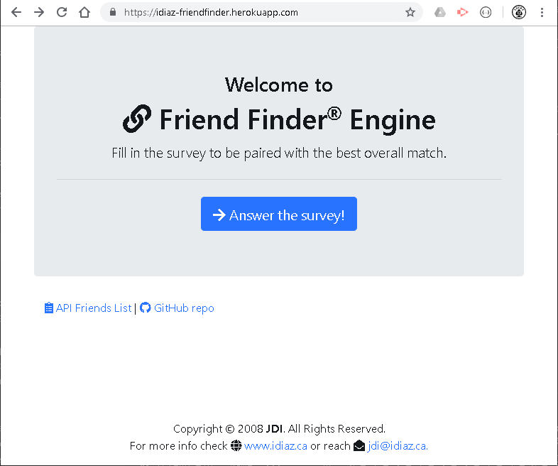
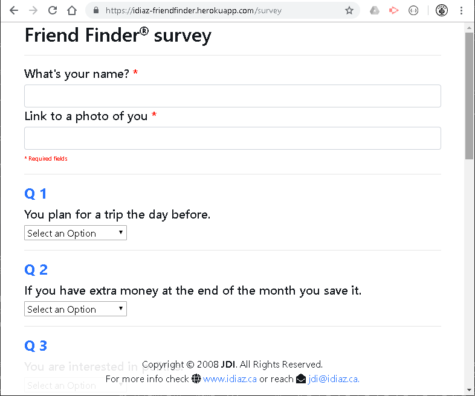
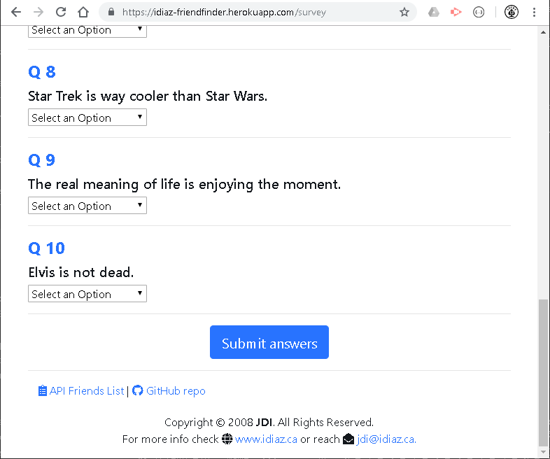
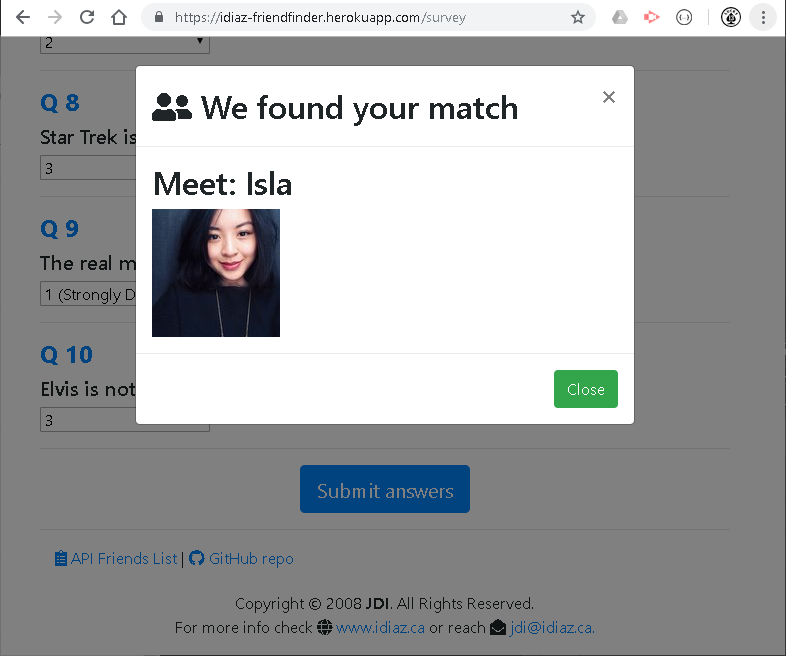

# FriendFinder
> **Cretaed by:**     Juan I Diaz (jdi@idiaz.ca)

> **Date:**           February 2019

## DESCRIPTION
This **FULL STACK** project is a compatibility-based "FriendFinder" application -- basically a dating app. The application will present a survey to the user; once the survey is filled in and submitted the back end will return the mest match from the current pool of friends. Then the front end (site) will display this friends name and image.

## INSTRUCTIONS
- This project has been deployed to Heroku, please enter to access https://idiaz-friendfinder.herokuapp.com/ to see the project.
1. Once on the home page click `Answer the survey!` to enter to the survey page.
2. Make sure to fill in **ALL** the fields!
3. Click `Submit answers` at the end of the survey to meet your match.

- There is a direct API link to receive all the friend in the system.

## SCREENSHOTS
`Home page`

`Survey page`

`Survey page`

`Displaying your match`

## BUILDING TOOLS
- FRONT END
    - HTML, CSS
    - Javascript and jQuery
    - Bootstrap
    - AJAX - API
- BACK END
    - node.js
    - Express

## QUESTIONS OR COMMENTS
- Feel free to contact the developer @ <jdi@idiaz.ca>!
- See the project [live](https://idiaz-friendfinder.herokuapp.com/).